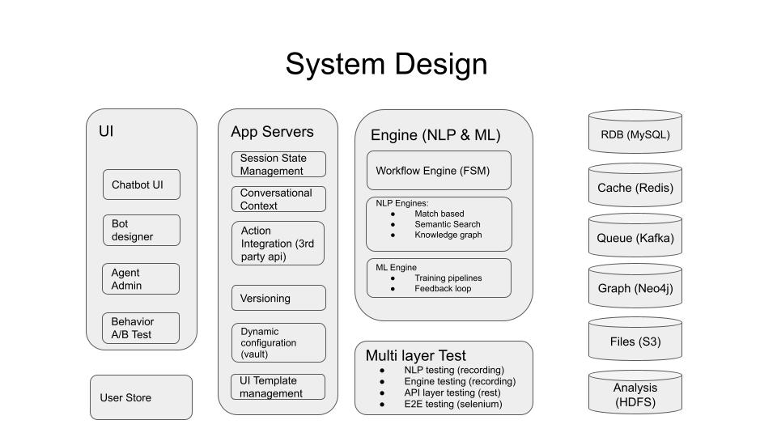
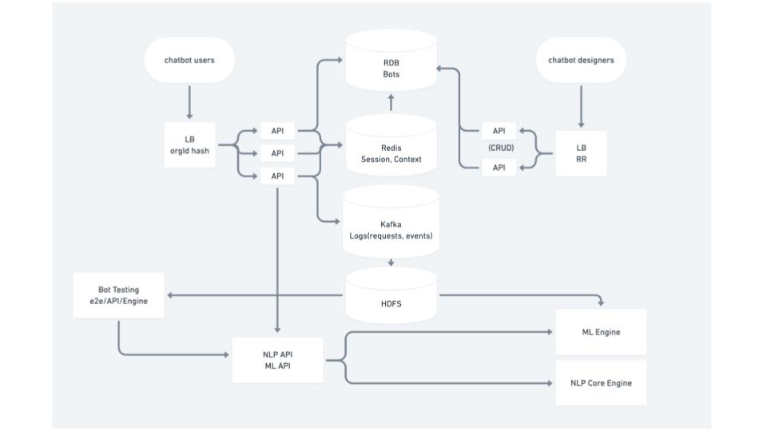
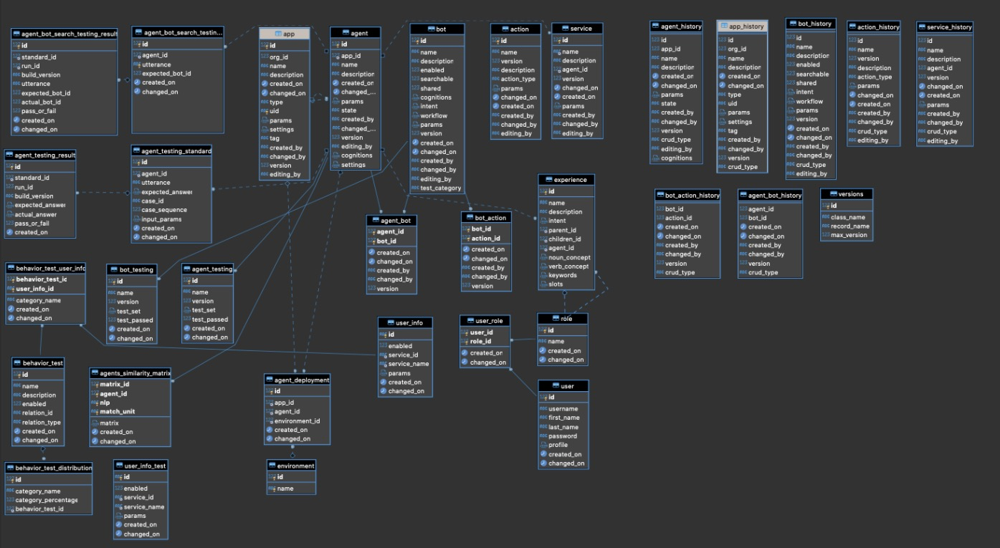
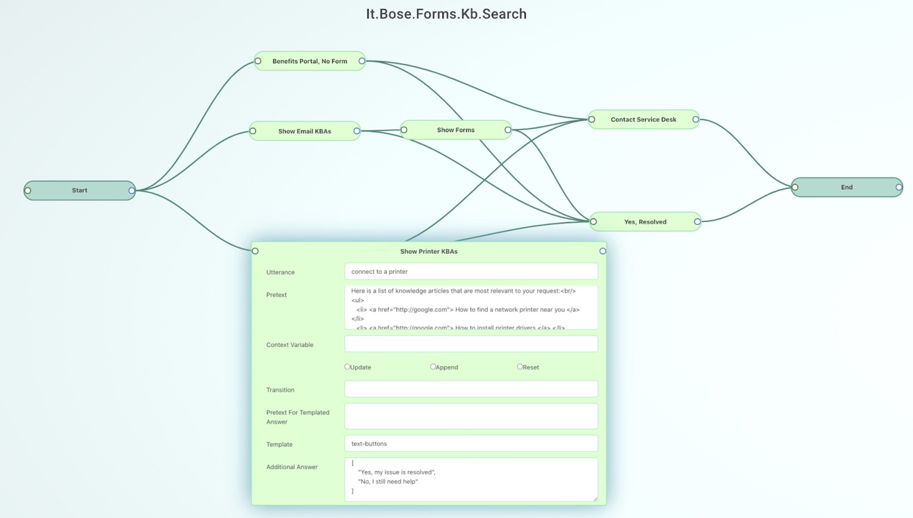
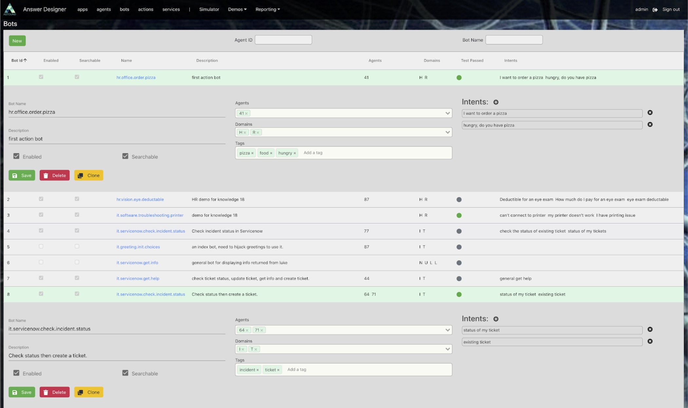
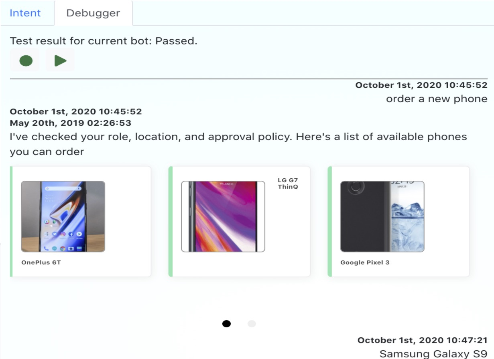
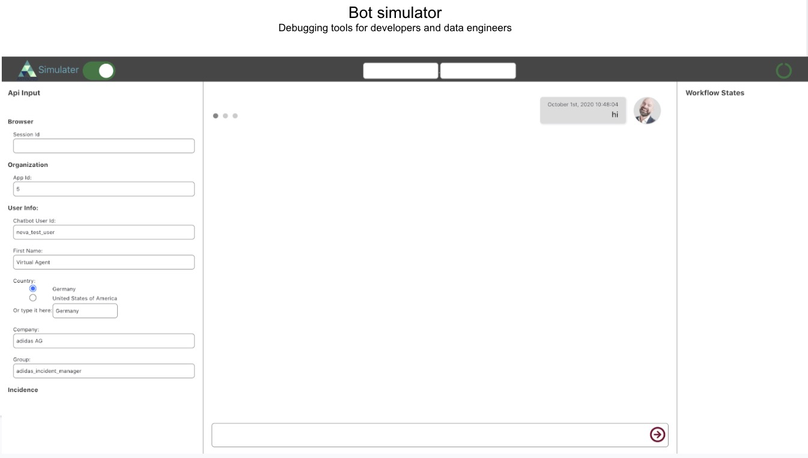
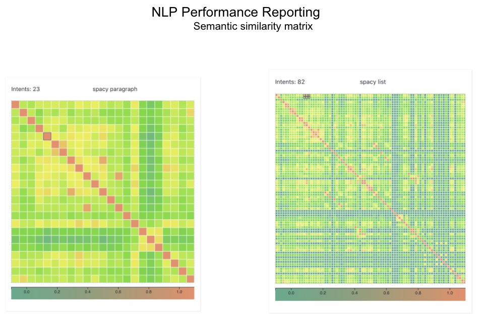

# Illusionist System Design

## System Design

* Infrusture:

* API and data flow:

* Data modals in relational DB.
  

## Bot Designer
Design a single bot conversation using FSM and behavior driven NLP engine.
This is the simplest demo bot that search the knowledge base of our client to find a specific form, based on semantic search.

## Bot Manager. 
Support multiple tenant, multiple user, with different UI designs. 

## Realtime bot: 
One example of action bot, injecting external APIs to accomplish certain actions during the conversation. 
This bot help an employee to choose a company provided list of cell phones, managed by the company in ServiceNow.
One action node make an API call to ServiceNow and guide the user to finish the ordering process.

## Bot Simulator 
Used for realtime conversation debugging. Target user bot creater.

## NLP analysis:
This tool compares one sentences to a bot pool, visulize whether the bog engine is picking the correct answer. Green is good, red is wrong.

